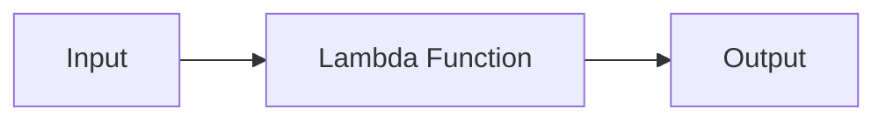

# Lambda Functions (Funções Lambda)

## O que são Funções Lambda?

Funções anônimas e concisas usadas para **tarefas específicas** sem necessidade de declaração formal.
**Características**:

- ✅ **Sem nome** (`lambda` substitui `def`)
- ✅ **Uso imediato** (criadas no local de utilização)
- ✅ **Limitadas a uma expressão**

**Exemplo Básico (Python)**:

```python
# Função tradicional
def quadrado(x):
    return x ** 2

# Lambda equivalente
quadrado = lambda x: x ** 2

print(quadrado(4))  # Saída: 16
```

---

## Quando Usar Lambdas?

### Casos Ideais

1. **Funções de Ordem Superior**

   ```python
   # Filtra números ímpares
   numeros = [1, 2, 3, 4, 5]
   impares = list(filter(lambda x: x % 2 != 0, numeros))
   ```

2. **Ordenação Personalizada**

   ```python
   produtos = [("Notebook", 2500), ("Mouse", 50)]
   ordenados = sorted(produtos, key=lambda item: item[1])
   ```

3. **Operações Rápidas**
   ```python
   # Multiplica todos os elementos por 2
   lista = [1, 2, 3]
   dobrados = list(map(lambda x: x * 2, lista))
   ```

### Quando Evitar

- **Lógica complexa** (prefira funções nomeadas)
- **Reutilização frequente** (viola o DRY)

---

## Otimização e Boas Práticas

### Regras de Ouro

1. **Simplicidade**

   ```python
   # Ruim: Múltiplas operações
   lambda x: (x ** 2) + (x / 2) - 1

   # Bom: Única operação clara
   lambda x: x ** 2
   ```

2. **Legibilidade**

   ```python
   # Ruim: Condicional confusa
   lambda x: "Par" if x % 2 == 0 else "Ímpar" if x != 0 else "Zero"

   # Bom: Estrutura clara
   lambda x: (
       "Zero" if x == 0 else
       "Par" if x % 2 == 0 else
       "Ímpar"
   )
   ```

3. **Testabilidade**
   - Lambdas são difíceis de debugar → Teste em console antes

---

## AWS Lambda (Computação Serverless)

### Exemplo Prático

Processa uploads de arquivos em um bucket S3:

```python
import json

def lambda_handler(event, context):
    for record in event['Records']:
        bucket = record['s3']['bucket']['name']
        arquivo = record['s3']['object']['key']
        print(f"Novo arquivo: {arquivo} no bucket {bucket}")

    return {
        'statusCode': 200,
        'body': json.dumps('Processado com sucesso!')
    }
```

**Vantagens na AWS**:

- Escalabilidade automática
- Cobrança por execução (não por servidor ocioso)

---

## Recursos Avançados

- **Frameworks**:
  - [Serverless Framework](https://www.serverless.com) (deploy fácil)
  - [Zappa](https://github.com/zappa/Zappa) (Python focado)
- **Exemplos Reais**:
  - [AWS Lambda Samples](https://github.com/aws-samples/aws-lambda-examples)

**Comparativo**:
| Tipo | Lambda Functions | Funções Tradicionais |
|------|------------------|----------------------|
| **Nome** | Anônimas | Nomeadas (`def`) |
| **Complexidade** | 1 expressão | Múltiplas linhas |
| **Reuso** | Limitado | Ideal |

> _"Use lambdas como atalhos, não como substitutos para funções completas."_

[Documentação Python](https://docs.python.org/3/tutorial/controlflow.html#lambda-expressions) | [AWS Lambda Docs](https://docs.aws.amazon.com/lambda/)



> Lambdas são como canivetes suíços: resolvem problemas pequenos com elegância, mas não substituem ferramentas completas. 🛠️
