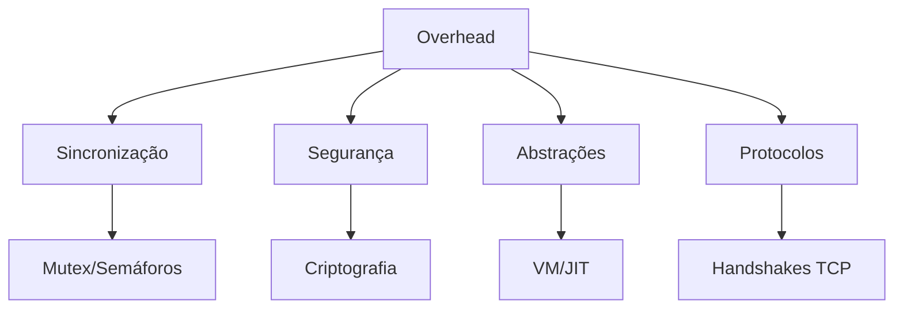

# Overhead em Sistemas Computacionais

## Definição

Custo adicional de recursos (CPU, memória, rede, disco) necessário para operações além do processamento principal.

## Tipos Principais

| Tipo de Overhead | Descrição                            | Exemplo Prático                           |
| ---------------- | ------------------------------------ | ----------------------------------------- |
| **Tempo de CPU** | Ciclos extras para gerenciamento     | Mutex em código concorrente               |
| **Memória**      | Estruturas auxiliares/alocação extra | Buffer de rede de 4KB por conexão         |
| **Rede**         | Dados adicionais em protocolos       | Cabeçalho TCP (20 bytes) vs UDP (8 bytes) |
| **Disco**        | Metadados e alocação não-ótima       | Blocos de 4KB para arquivos pequenos      |

## Causas Comuns



## Técnicas de Mitigação

### 1. Otimização de Algoritmos

- **Estruturas de dados**: Escolher entre hash tables (O(1)) vs listas (O(n))
- **Alocação memória**: Pools de objetos vs alocação dinâmica

```c
// Exemplo: Memory pool
Object* pool = malloc(1000 * sizeof(Object));
```

### 2. Monitoramento

- **Ferramentas**:
  - `perf` (Linux)
  - VisualVM (Java)
  - Chrome DevTools (Web)

### 3. Protocolos Eficientes

- **Escolha de protocolos**:
  - UDP para streaming vs TCP para transferência confiável
  - Protocolos binários (gRPC/Protobuf) vs texto (JSON/XML)

## Casos Críticos

1. **Virtualização**:

   - Overhead de hypervisor (5-15% CPU)
   - Solução: Paravirtualização (Xen) ou KVM

2. **Microserviços**:

   - Serialização/deserialização repetida
   - Solução: Formatos binários (Avro, Cap'n Proto)

3. **Contêineres**:
   - Namespace/cgroups management
   - Solução: `runc` otimizado

> **Regra de Ouro**: Sempre medir antes de otimizar - muitos overheads são insignificantes no contexto geral do sistema.
