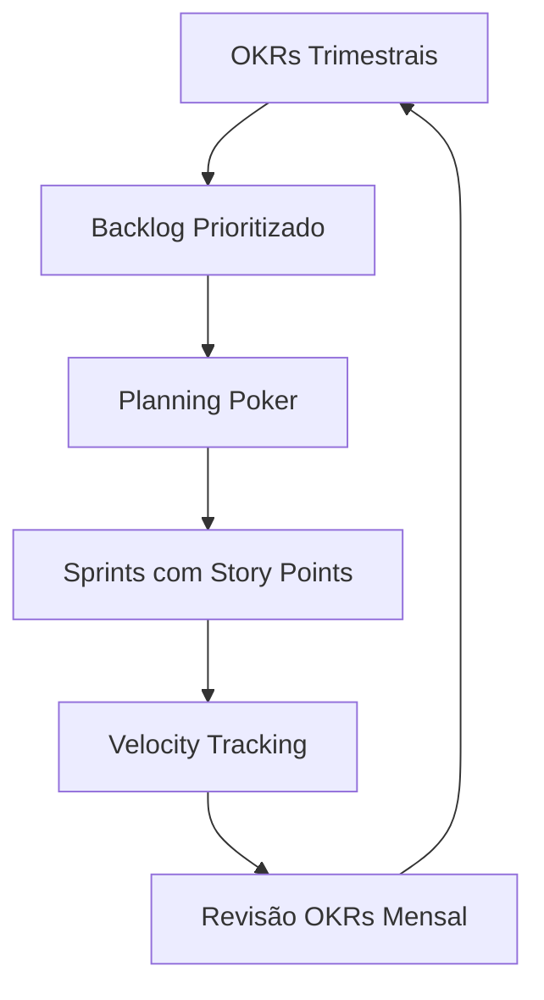

# Pontos de História e OKRs em Engenharia de Software

## 1. Pontos de História (Story Points)

### Conceitos Fundamentais

- **Definição**: Unidades abstratas que medem esforço relativo (complexidade, risco, trabalho)
- **Propósito**: Planejamento ágil sem vincular a horas/dias exatos
- **Analogia**:
  Se corrigir um bug simples = 1 ponto,
  uma feature média = 5 pontos,
  uma reestruturação complexa = 13 pontos

### Processo de Estimação

1. **Planning Poker**
   ```python
   # Valores típicos na sequência Fibonacci
   pontos = [1, 2, 3, 5, 8, 13, 21]
   ```
2. **Velocidade da Equipe**
   - Média de pontos entregues por sprint
   - Exemplo: Se a equipe completa 20 pontos/sprint, planeje sprints futuros com ~20 pontos

### Benefícios

| Vantagem        | Impacto                                    |
| --------------- | ------------------------------------------ |
| Consenso        | Discussões técnicas antes da implementação |
| Flexibilidade   | Adaptável a diferentes tipos de tarefas    |
| Foco no esforço | Evita estimativas temporais imprecisas     |

## 2. OKRs (Objectives and Key Results)

### Estrutura Básica

```markdown
**Objetivo**: Qualitativo e inspirador
**Resultados-Chave (3-5)**:

- KR1: Métrica quantitativa #1
- KR2: Métrica quantitativa #2
```

### Exemplo em Tech

**Objetivo**: Melhorar a confiabilidade do sistema
**KRs**:

1. Reduzir incidentes críticos de 5 para ≤1/mês
2. Aumentar cobertura de testes de 70% para 90%
3. Reduzir tempo de deploy de 30 para 10 minutos

### Ciclo de Implementação

1. **Definição Trimestral**
   - Workshop com equipes
2. **Check-ins Semanais**
   ```bash
   # Exemplo de acompanhamento
   $ okr-status --objective "Confiabilidade" --progress 65%
   ```
3. **Avaliação Final**
   - Pontuação: 0.0-1.0 por KR
   - Meta ideal: 70-80% (desafiadora mas realista)

## Comparação Crítica

| Critério      | Pontos de História       | OKRs                         |
| ------------- | ------------------------ | ---------------------------- |
| Foco          | Tarefas técnicas         | Metas estratégicas           |
| Métrica       | Esforço relativo         | Resultados mensuráveis       |
| Temporalidade | Sprints (2-4 semanas)    | Trimestres                   |
| Nível         | Equipe de dev            | Organização/Equipe           |
| Flexibilidade | Alta (ajuste por sprint) | Média (revisões trimestrais) |

## Fluxo Integrado (Ágil + OKRs)



## Ferramentas Recomendadas

1. **Pontos de História**:
   - Jira, Azure DevOps
   - PlanningPoker.com
2. **OKRs**:
   - OKRBoard (open-source)
   - GTMhub
   - Spreadsheets (para iniciantes)

_"Story Points medem o caminho, OKRs definem o destino - juntos, orientam a jornada ágil."_

> **Dica Prática**: Comece com 3 objetivos e 2-3 KRs por equipe no primeiro trimestre. Priorize métricas que realmente impulsionem o negócio.
