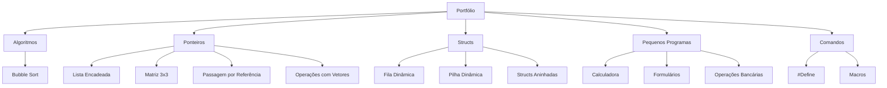
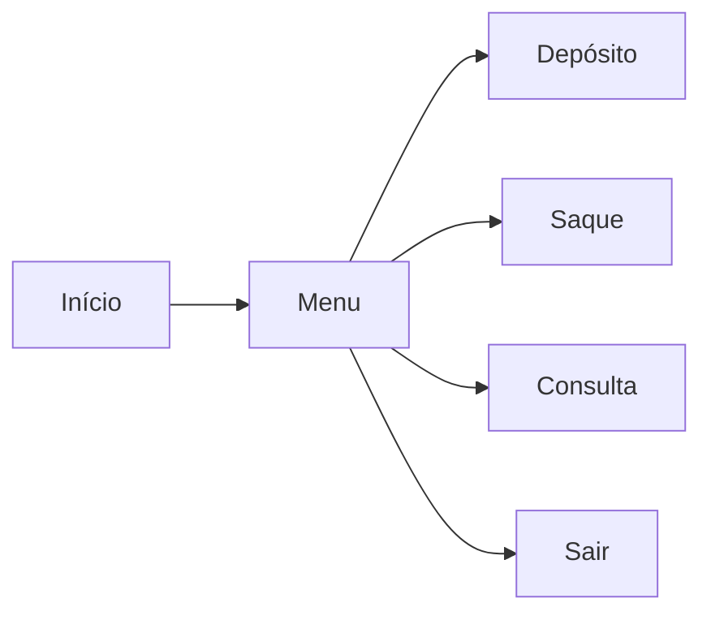

# Portfólio de C/C++ Básico

## Estrutura do Projeto



## Principais Habilidades Demonstradas

### 1. Manipulação de Ponteiros

- **Aplicações**:
  - Listas encadeadas
  - Passagem por referência
  - Operações com vetores
- **Exemplo**:

```c
void dobrarValores(int *vetor, int tamanho) {
    for(int i = 0; i < tamanho; i++) {
        *(vetor + i) *= 2;
    }
}
```

### 2. Estruturas de Dados

| Estrutura       | Implementação          | Características            |
| --------------- | ---------------------- | -------------------------- |
| Fila            | Dinâmica com ponteiros | FIFO (First-In-First-Out)  |
| Pilha           | Alocação dinâmica      | LIFO (Last-In-First-Out)   |
| Lista Encadeada | Ponteiros e structs    | Inserção/Remoção eficiente |

### 3. Programação Modular

- Uso de **#define** para constantes:

```c
#define MAX_CLIENTES 100
#define TAXA_JUROS 0.05
```

- Macros úteis:

```c
#define MAIOR(x,y) (x > y ? x : y)
```

## Projetos Práticos

### Sistema Bancário



### Calculadora de Descontos

- Lógica condicional com switch-case
- Formatação de saída
- Tratamento de entrada

## Fluxo de Aprendizado Recomendado

1. Comece pelos **Pequenos Programas**
2. Domine **Ponteiros e Structs**
3. Avance para **Estruturas Dinâmicas**
4. Explore **Otimizações com Macros**

> "O código é poesia lógica. Escreva com clareza, documente com precisão." - Adaptado de Linus Torvalds

[🔗 Acesse os códigos completos](#) (link fictício para exemplo)

```

**Destaques do Portfólio**:
- Abordagem prática desde conceitos básicos até estruturas complexas
- Ênfase em gerenciamento de memória (alocação dinâmica)
- Boas práticas de organização e documentação
- Projetos com aplicação real (sistema bancário, calculadoras)

**Próximos Passos**:
- Implementação de algoritmos de ordenação avançados
- Integração com arquivos para persistência de dados
- Desenvolvimento de interfaces gráficas simples
```
