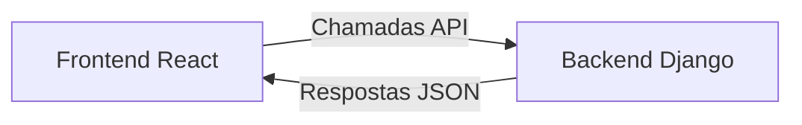

# React e Django: Integração Fullstack

## Visão Geral das Tecnologias

### Django (Backend)

- **Framework Python** para desenvolvimento web
- **Principais recursos**:
  - ORM para banco de dados
  - Sistema de autenticação pronto
  - Painel de administração automático
  - Django REST Framework para APIs

### React (Frontend)

- **Biblioteca JavaScript** para interfaces
- **Características chave**:
  - Componentes reutilizáveis
  - Virtual DOM para performance
  - Ecossistema rico (Redux, React Router)

## Arquitetura Cliente-Servidor



## Casos de Uso Reais

| Aplicação | Uso do Django                        | Uso do React                 |
| --------- | ------------------------------------ | ---------------------------- |
| Instagram | Gerenciamento de dados, autenticação | Interface interativa         |
| Udemy     | Cursos, pagamentos                   | Player de vídeo, UI dinâmica |
| Disqus    | Armazenamento de comentários         | Exibição em tempo real       |

## Fluxo de Comunicação

1. **Frontend (React)**:

   - Faz requisições HTTP para endpoints API
   - Gerencia estado da aplicação
   - Renderiza componentes dinâmicos

2. **Backend (Django)**:
   - Processa requisições
   - Acessa banco de dados via ORM
   - Retorna dados em JSON

**Exemplo de endpoint**:

```python
# Django View
from rest_framework.decorators import api_view
from rest_framework.response import Response

@api_view(['GET'])
def get_data(request):
    data = {"message": "Hello from Django!"}
    return Response(data)
```

**Consumo no React**:

```javascript
// React Component
useEffect(() => {
  fetch("/api/get_data/")
    .then((response) => response.json())
    .then((data) => console.log(data));
}, []);
```

## Configuração Básica

1. **Backend**:

   - Instale Django REST Framework
   - Configure CORS headers
   - Crie serializers para modelos

2. **Frontend**:
   - Configure React Router
   - Defina serviços API
   - Gerencie estado (Context API/Redux)

## Vantagens da Combinação

- **Produtividade**: Django acelera desenvolvimento backend
- **Interatividade**: React cria UIs ricas
- **Manutenção**: Separação clara de responsabilidades
- **Escalabilidade**: Arquitetura moderna e flexível

> _"Django fornece a fundação sólida, React traz a experiência do usuário - juntos formam uma stack poderosa."_ - Adaptado de Daniel Gehlen

**Próximos Passos**:

- [Documentação Django REST](https://www.django-rest-framework.org/)
- [React Official Docs](https://reactjs.org/docs/getting-started.html)
