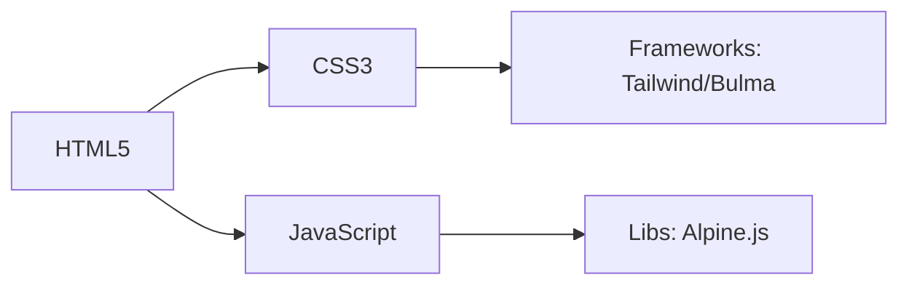

# Site White Label: Conceitos e Implementação

## Definição e Características

**O que é**:
Solução tecnológica desenvolvida por uma empresa e rebrandizada por outras como se fosse própria.

**Principais atributos**:

- **Customização total** de marca e identidade visual
- **Infraestrutura compartilhada** com múltiplos clientes
- **Economia de custos** (não requer desenvolvimento do zero)

**Setores de aplicação**:

- E-commerce
- Plataformas SaaS
- Serviços financeiros
- Sistemas de educação online

## Vantagens Competitivas

| Benefício                       | Impacto                                                   |
| ------------------------------- | --------------------------------------------------------- |
| Redução de TTM (Time-to-Market) | Lançamento em semanas ao invés de meses                   |
| Custos operacionais menores     | Elimina necessidade de equipe de desenvolvimento dedicada |
| Atualizações centralizadas      | Todos os clientes recebem melhorias simultâneas           |

## Modelo de Site Estático

### Quando utilizar?

- Páginas institucionais
- Portfólios
- Landing pages
- Blogs simples

**Tecnologias recomendadas**:



### Hospedagem Gratuita

**Opções populares**:

1. **GitHub Pages**

   - Integração nativa com repositórios Git
   - Limite: 1GB de armazenamento

2. **Netlify**

   - Deploy contínuo via Git
   - Recursos extras: Forms, Lambda Functions

3. **Vercel**
   - Otimizado para JAMstack
   - Preview deployments para testes

**Comparativo**:
| Serviço | SSL Grátis | Custom Domain | Bandwidth |
|---------|-----------|---------------|-----------|
| GitHub Pages | Sim | Sim | 100GB/mês |
| Netlify | Sim | Sim | Ilimitado\* |
| Vercel | Sim | Sim | 100GB/mês |

## Fluxo de Implementação White Label

1. **Desenvolvimento Core**

   - Código base com módulos customizáveis
   - API de branding (cores, logos, textos)

2. **Painel de Controle**

   - Upload de assets de marca
   - Seletor de temas CSS

3. **Deploy Multi-tenant**
   - Isolamento de dados por cliente
   - Domínios customizados (CNAME)

**Exemplo Arquitetura**:

```bash
.
├── core/           # Lógica compartilhada
├── tenants/        # Configurações por cliente
│   ├── clientA/
│   │   ├── brand.json
│   │   └── theme.css
│   └── clientB/
└── deploy/         # Scripts de publicação
```

## Dicas para Provedores

- Oferecer documentação clara de customização
- Manter sistema de design modular
- Implementar analytics por tenant
- Considerar modelo revenue-share

> _"A tecnologia white label democratiza o acesso a soluções digitais sofisticadas para empresas de todos os portes."_ - Adaptado de Daniel Gehlen

**Próximos Passos**:
[Documentação GitHub Pages](https://pages.github.com/) | [Netlify Starter Guide](https://docs.netlify.com/)
