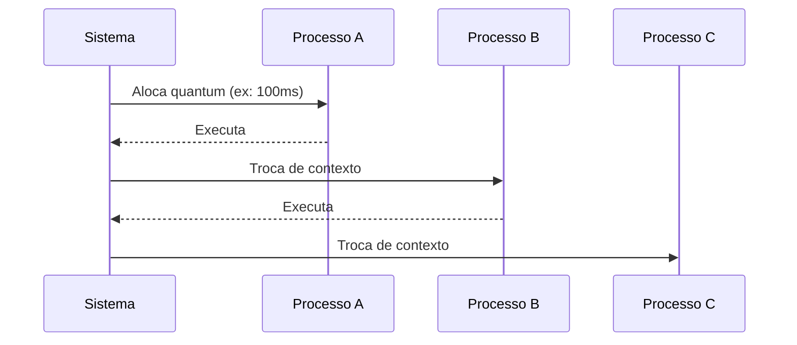

# Time-sharing (Compartilhamento de Tempo)

## Conceito Fundamental

Técnica que permite múltiplos usuários ou processos compartilharem recursos de um sistema de forma interativa e eficiente, alternando rapidamente o uso da CPU entre tarefas.

## Mecanismo de Funcionamento



## Componentes Chave

| Elemento              | Descrição                              | Exemplo                         |
| --------------------- | -------------------------------------- | ------------------------------- |
| **Quantum**           | Fatia de tempo por processo            | 10ms-100ms em sistemas modernos |
| **Escalonador**       | Gerencia a alternância entre processos | CFS (Linux), Windows Scheduler  |
| **Troca de Contexto** | Salva/restaura estados dos processos   | ~1-100μs de overhead            |

## Políticas de Escalonamento

1. **Round Robin**

   - Quantum fixo para todos
   - Exemplo: Sistemas de terminal antigos

2. **Prioridades Dinâmicas**

   - Ajusta quantum baseado no tipo de processo
   - Exemplo: Processos interativos recebem mais tempo

3. **Multilevel Feedback**
   - Combina múltiplas filas com políticas diferentes
   - Exemplo: Linux (processos I/O-bound sobem de prioridade)

## Vantagens

✅ **Eficiência**: CPU raramente ociosa
✅ **Interatividade**: Resposta rápida para múltiplos usuários
✅ **Equidade**: Nenhum processo monopoliza recursos

## Desafios

⚠️ **Overhead**: Troca de contexto consome tempo
⚠️ **Tuning**: Quantum muito curto = muitas trocas
Quantum muito longo = baixa responsividade

## Casos de Uso Modernos

- **Cloud Computing**: VMs compartilhando recursos físicos
- **Contêineres**: Orchestrators como Kubernetes
- **Terminais Remotos**: SSH multiusuário

> **Exemplo Prático**: No Linux, o `nice` ajusta prioridades:
>
> ```bash
> nice -n 19 ./processo_longo  # Prioridade baixa
> nice -n -20 ./processo_critico  # Prioridade máxima
> ```
