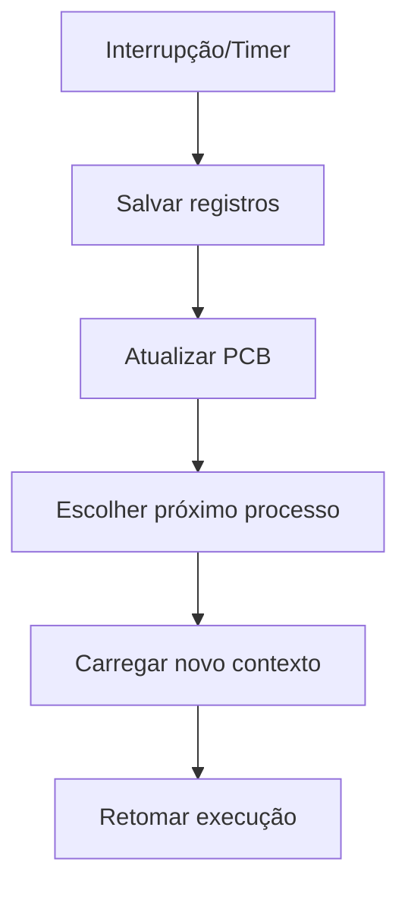

# Contexto em Sistemas Computacionais

## Definição

Conjunto de informações que preserva o estado de um processo/thread para permitir sua execução interrompível e retomada segura.

## Componentes do Contexto de Processo

| Categoria             | Elementos Típicos                       | Tamanho (x86-64) |
| --------------------- | --------------------------------------- | ---------------- |
| **Registradores**     | PC, SP, AX, BX, FLAGS                   | ~200 bytes       |
| **Espaço de Memória** | Código, Dados, Heap, Stack              | Variável         |
| **Estado**            | PID, Prioridade, Estado (Ready/Running) | ~100 bytes       |
| **Recursos**          | Arquivos abertos, Sockets, Locks        | Variável         |

## Troca de Contexto (Context Switch)



**Overhead Típico**: 1-100μs (depende da arquitetura)

## Contexto vs Thread vs Processo

| Feature           | Processo | Thread            |
| ----------------- | -------- | ----------------- |
| **Memória**       | Isolada  | Compartilhada     |
| **Registradores** | Únicos   | Únicos por thread |
| **Stack**         | Único    | Individual        |
| **Recursos**      | Próprios | Compartilhados    |

## Aplicações Críticas

1. **Sistemas de Tempo Real**

   - Context switching determinístico
   - Ex: `PREEMPT_RT` no Linux

2. **Contêineres**

   - Namespaces mantêm contexto isolado

   ```bash
   docker exec -it <container> bash  # Novo contexto
   ```

3. **Debugging**
   - Inspect context durante breakpoints
   ```gdb
   (gdb) info registers
   (gdb) backtrace
   ```

## Otimizações Modernas

- **FPU State Lazy Saving**: Adia salvamento de registros float
- **PCB Caching**: Cache de Process Control Blocks frequentes
- **SMP Affinity**: Minimiza trocas entre núcleos

> **Dica**: Em C, use `getcontext()`/`setcontext()` para gerenciamento manual:
>
> ```c
> ucontext_t ctx;
> getcontext(&ctx);  // Salva contexto
> setcontext(&ctx);  // Restaura
> ```
