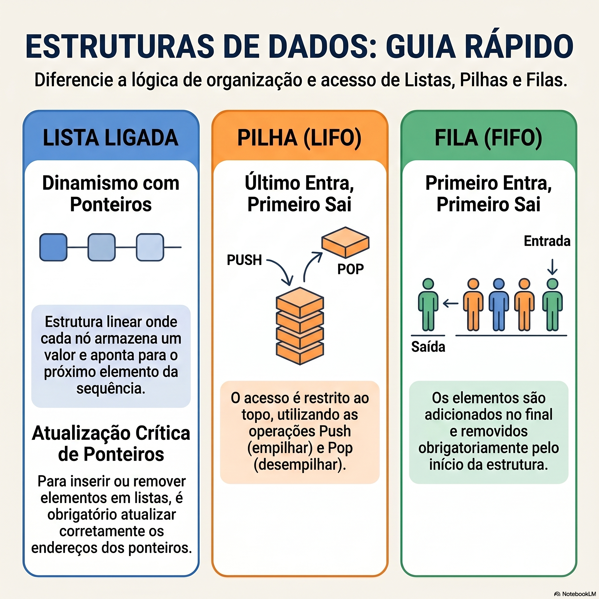

**Estruturas de Dados: A Escolha que Define Eficiência e Comportamento no Código 🧱**

Entrega de software eficiente começa na escolha certa da estrutura de dados. Não é sobre qual é "melhor" — é sobre qual se alinha ao comportamento esperado. No meu dia a dia, a decisão entre **Lista Ligada, Pilha ou Fila** impacta diretamente performance, legibilidade e manutenção.

🔹 **Lista Ligada: Dinamismo Controlado por Ponteiros**

- Estrutura linear onde cada nó armazena um valor e uma referência (ponteiro) para o próximo elemento.
- **Vantagem:** Inserção e remoção em qualquer ponto sem realocar toda a estrutura.
- **Cuidado crítico:** Para inserir ou remover elementos, atualizo corretamente os endereços dos ponteiros — um erro aqui quebra a cadeia inteira.

🔹 **Pilha (LIFO): Último a Entrar, Primeiro a Sair**

- Acesso restrito ao **topo** da estrutura.
- **Operações:** `Push` (empilhar) adiciona um elemento no topo; `Pop` (desempilhar) remove o elemento do topo.
- **Aplico em:** Desfazer/refazer (Ctrl+Z), avaliação de expressões, backtracking em algoritmos.

🔹 **Fila (FIFO): Primeiro a Entrar, Primeiro a Sair**

- Elementos são adicionados no **final** e removidos obrigatoriamente pelo **início**.
- **Operações:** `Enqueue` (inserir no fim), `Dequeue` (remover do início).
- **Aplico em:** Processamento de tarefas em lote, buffers de I/O, filas de impressão, mensageria.

🔹 **Comparação Direta**

| Estrutura        | Princípio                          | Acesso                     | Uso Típico                            |
| ---------------- | ---------------------------------- | -------------------------- | ------------------------------------- |
| **Lista Ligada** | Ponteiros sequenciais              | Qualquer ponto (com busca) | Inserções/remoções frequentes no meio |
| **Pilha (LIFO)** | Último a entrar, primeiro a sair   | Restrito ao topo           | Desfazer, avaliação de expressões     |
| **Fila (FIFO)**  | Primeiro a entrar, primeiro a sair | Restrito ao início/fim     | Processamento por ordem de chegada    |

Dominar essas estruturas é o que me permite **escolher a ferramenta certa para o problema certo** — sem superengenharia, sem gargalos desnecessários.

#estruturasdedados #listaligada #pilha #fila #lifo #fifo #algoritmos #programacao #performance #desenvolvimento #ti #tech #dev #techrecruiter
