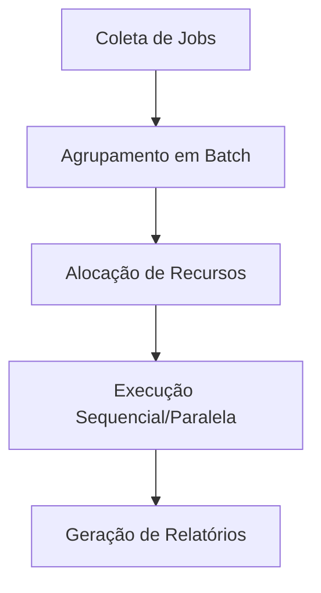

# Jobs e Batches em Computação

## Definições Fundamentais

| Conceito  | Descrição                                | Características                             |
| --------- | ---------------------------------------- | ------------------------------------------- |
| **Job**   | Unidade individual de trabalho           | Pode ser interativo ou não-interativo       |
| **Batch** | Conjunto de jobs agrupados para execução | Sem interação, execução sequencial/paralela |

## Sistemas de Gerenciamento

### Job Schedulers Comuns

- **Slurm**: Para clusters HPC
  ```bash
  sbatch script.sh  # Submissão de job
  squeue           # Lista jobs agendados
  ```
- **Apache Airflow**: Orquestração de workflows
- **Cron**: Agendamento em Unix
  ```bash
  0 2 * * * /backup.sh  # Executa diariamente às 2AM
  ```

## Processamento em Lote (Batch)

**Fluxo Típico**:



**Vantagens**:

- ✅ Eficiência no uso de recursos
- ✅ Redução de custos operacionais
- ✅ Automatização de tarefas repetitivas

## Exemplos Práticos

1. **Mainframes Financeiros**

   - Processamento noturno de transações
   - Atualização de bancos de dados em lote

2. **CI/CD Pipelines**

   ```yaml
   # Exemplo GitLab CI
   deploy_prod:
     stage: deploy
     script: ./deploy.sh
     only:
       - schedules # Execução em batch agendada
   ```

3. **Processamento Científico**
   ```python
   # Job array no Slurm
   #SBATCH --array=1-100  # 100 jobs paralelos
   ```

## Comparação: Tempo Real vs Batch

| Critério        | Tempo Real           | Batch Processing   |
| --------------- | -------------------- | ------------------ |
| Latência        | Milissegundos        | Minutos/Horas      |
| Throughput      | Baixo                | Alto               |
| Uso de Recursos | Prioritário          | Otimizado          |
| Exemplos        | Transações bancárias | Relatórios mensais |

> **Dica de Otimização**: Para batches grandes:
>
> - Particione jobs em tamanhos similares
> - Use sistemas como Apache Spark para processamento distribuído
> - Agende para horários de baixa carga (ex: `at 02:00`)
