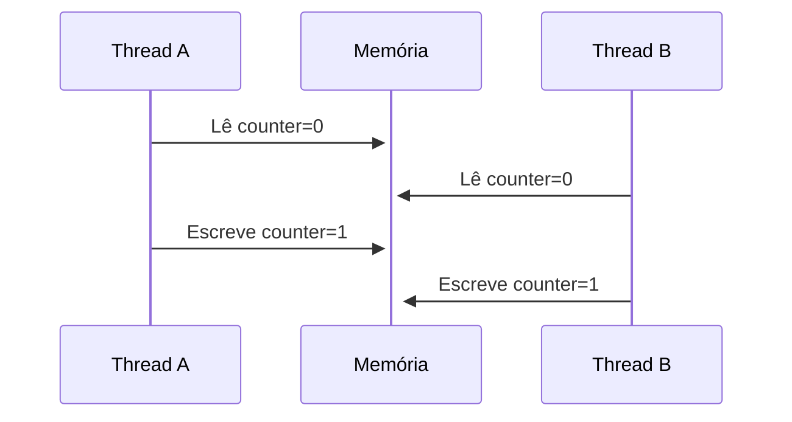

# Race Condition (Condição de Corrida)

## Definição

Problema de concorrência onde o resultado final depende da ordem não controlada de execução entre threads/processos que acessam recursos compartilhados.

## Mecanismo Básico



## Exemplo Crítico

```c
int saldo = 1000;  // Recurso compartilhado

void saque(int valor) {
    if (saldo >= valor) {
        sleep(1);  // Simula processamento
        saldo -= valor;
    }
}
```

**Risco**: Dois saques simultâneos podem ultrapassar o saldo disponível

## Técnicas de Prevenção

### 1. Sincronização com Mutex

```cpp
std::mutex mtx;

void operacao_segura() {
    std::lock_guard<std::mutex> lock(mtx);
    // Região crítica
}
```

### 2. Atomics (Sem bloqueio)

```cpp
std::atomic<int> counter(0);
counter.fetch_add(1, std::memory_order_relaxed);
```

### 3. Padrões de Design Seguros

- **Imutabilidade**: Dados somente-leitura após criação
- **Copy-on-Write**: Novas cópias para modificações
- **STM (Software Transactional Memory)**: Transações atômicas

## Comparação de Técnicas

| Técnica   | Overhead | Escalabilidade | Complexidade |
| --------- | -------- | -------------- | ------------ |
| Mutex     | Alto     | Baixa          | Média        |
| Spinlock  | Médio    | Média          | Baixa        |
| Atomics   | Baixo    | Alta           | Alta         |
| Lock-free | Mínimo   | Alta           | Muito Alta   |

## Detecção e Debug

- **Ferramentas**:
  - ThreadSanitizer (TSan)
  - Helgrind (Valgrind)
  - Visual Studio Concurrency Visualizer

_por Daniel Gehlen_

> **Dica**: Em C++ moderno, prefira:
>
> ```cpp
> std::scoped_lock lock(mutex1, mutex2);  // Seguro contra deadlocks
> ```
>
> ao invés de raw mutex locks.
