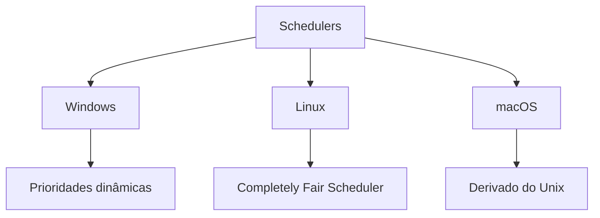

# Scheduler (Escalonador)

## Funções Principais

- **Alocação de CPU**: Decide qual processo/thread executa e por quanto tempo
- **Troca de Contexto**: Gerencia transições entre processos (salva/restaura estados)
- **Balanceamento**: Distribui carga entre núcleos de CPU
- **Priorização**: Garante atendimento a processos críticos

## Políticas de Escalonamento

| Política                     | Descrição                                  | Vantagens                    | Desvantagens                 |
| ---------------------------- | ------------------------------------------ | ---------------------------- | ---------------------------- |
| **Round Robin (RR)**         | Quantum fixo por processo                  | Justo, previsível            | Baixa eficiência para I/O    |
| **Shortest Job First (SJF)** | Executa menor tarefa primeiro              | Tempo médio de espera mínimo | Difícil prever tempos        |
| **Priority Scheduling**      | Baseado em prioridades estáticas/dinâmicas | Atende requisitos críticos   | Risco de starvation          |
| **Multilevel Queue**         | Múltiplas filas com políticas diferentes   | Flexibilidade                | Complexidade de configuração |
| **CFS (Linux)**              | Baseado em vruntime (tempo virtual)        | Alta justiça                 | Overhead de árvore RB        |

## Implementações em SOs



## Exemplo: Round Robin

```c
// Pseudocódigo simplificado
while(1) {
    processo = fila_ready.dequeue();
    executar(processo, quantum);
    if (processo.não_terminou)
        fila_ready.enqueue(processo);
}
```

## Desafios

- **Trade-off**: Responsividade vs Throughput
- **Starvation**: Processos de baixa prioridade nunca executam
- **Multicore**: Balanceamento entre núcleos
- **Overhead**: Custo de troca de contexto (~1-100μs)

_por Daniel Gehlen_

> **Dica**: Em sistemas Linux, ajustes comuns:
>
> ```bash
> chrt -f 99 ./programa  # Prioridade máxima (FIFO)
> taskset -c 0,1 ./programa  # Restringe a núcleos 0-1
> ```
