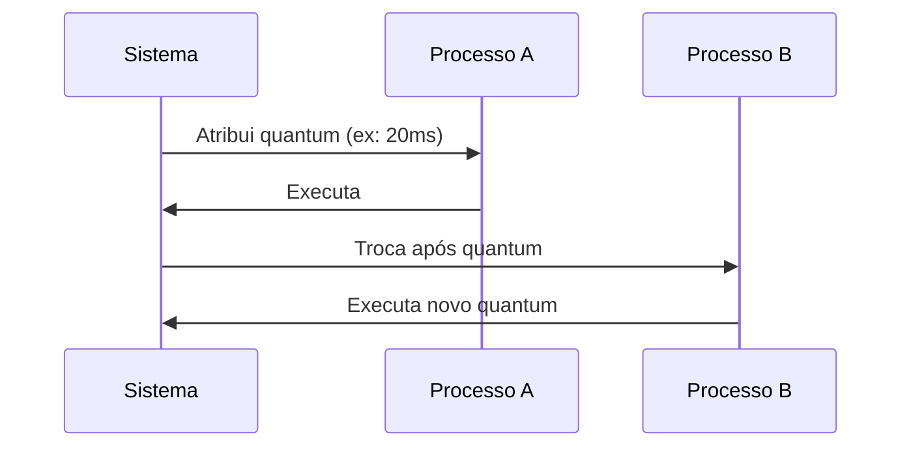

# Time-Slice (Quantum de Tempo)

## Conceito Fundamental

Intervalo de tempo alocado a um processo/thread para execução ininterrupta antes da preempção pelo escalonador.

## Mecanismo de Funcionamento



## Parâmetros Típicos

| Sistema Operacional | Quantum Padrão | Ajustável |
| ------------------- | -------------- | --------- |
| Linux (CFS)         | 6ms-100ms      | Sim       |
| Windows             | 20ms-120ms     | Parcial   |
| macOS               | 10ms-50ms      | Sim       |

## Impacto no Desempenho

**Efeito do Tamanho do Quantum**:

- ➕ **Quantum Grande**:
  ✅ Menos trocas de contexto
  ❌ Baixa responsividade

- ➖ **Quantum Pequeno**:
  ✅ Melhor interatividade
  ❌ Alto overhead de troca

## Exemplo de Cálculo

Fórmula básica para sistemas Round-Robin:

```
Tempo_resposta ≈ (N_processos × Quantum) / N_núcleos
```

## Casos Especiais

1. **Processos I/O-bound**:

   - Frequentemente liberam CPU voluntariamente
   - Podem receber quanta menores

2. **Processos CPU-bound**:
   - Consomem todo o quantum
   - Prioridade reduzida em alguns schedulers

## Boas Práticas de Configuração

```bash
# Linux: Ajustar quantum do CFS
echo 10000000 > /proc/sys/kernel/sched_latency_ns
echo 5000000 > /proc/sys/kernel/sched_min_granularity_ns
```

> **Dica de Otimização**: Para servidores web (alta concorrência):
>
> - Quantum menor (5-15ms)
> - Priorizar processos I/O-bound
> - Habilitar preemptão kernel (`CONFIG_PREEMPT`)
